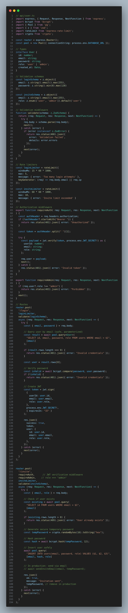

# Code Review: api/user.ts

## Summary

This code has critical security vulnerabilities that must be addressed before production deployment. 

The main concerns are SQL injection, weak password hashing, insecure session management, and lack of input validation.

## Issues Breakdown:
    1- Security Issues:  SQL injection, MD5 hashing, insecure tokens, global sessions
    2- Bugs & Error Handling:  no input validation, error handling, hardcoded roles
    3. API & Architecture Concerns:  No rate limitting, missing types

## Security Issues

**1- SQL Injection**

**Issue** : String concatenation in SQL queries allows attackers to execute arbitrary SQL commands.
  
    // Login endpoint
    const sql = `SELECT * FROM users WHERE email='${email}' AND password='${hash}'`;

    // Invite endpoint
    const q = await pool.query(`INSERT INTO users(email,password,role) VALUES('${req.body.email}','${hash}','admin')`);
**Fix** :  Use parametrized queries
    
    // Login - FIXED
    const sql = 'SELECT * FROM users WHERE email = $1 AND password = $2';
    const result = await pool.query(sql, [email, hash]);

    // Invite - FIXED
    const sql = 'INSERT INTO users(email, password, role) VALUES($1, $2, $3) RETURNING *';
    const result = await pool.query(sql, [req.body.email, hash, 'admin']);

**2- Weak Password Hashing (MD5)**

**Issue** : MD5 is cryptographically broken and unsuitable for passwords

**Fix:** Use `bcrypt`

    const hash = await bcrypt.hash(password, 12); 

**3- Insecure Token Generation**

**Issue** :
   - Token is a Base64-encoded string of email + timestamp.
   - This is predictable and not signed

**Fix:** 
    
    Use JWT (`jsonwebtoken`)
        const token = jwt.sign({ 
            email: user.email, 
            userId: user.id 
        }, process.env.JWT_SECRET!,{ 
            expiresIn: '24h', algorithm: 'HS256' 
        }
    );

**4- Global Session Storage**

**Issue** :
  - Storing sessions in `global` is unsafe and does not scale.
  - Sessions will be lost on restart and are shared across requests.

**Fix:** Use Redis or stateless JWT authentication.

## Bugs & Error Handling: 

**1- No Input Validation**

**Issue** : No validation of request body. Missing email format validation, password requirements, or null checks.

**Fix:** Use validation library (Zod, Joi, or express-validator).

**2- Poor Error Handling**

**Issue** : No try-catch blocks. Database errors expose internal details to clients.

**Fix** : Proper error handling with logging

**3- Hardcoded Admin Role in Invite**

**Issue** : All invited users automatically get 'admin' role, which is a massive security risk.

**Fix**: Accept role from request with validation and authorization
    
    // Define allowed roles ['user', 'admin']
    // Schema with role validation
    const inviteSchema = z.object({
            email: z.string().email(),
            role: z.enum(VALID_ROLES).default('user') // Default to least privilege
    });
    // Authorization middleware - only admins can invite

## API & Architecture Concerns

**1- No rate limiting**

**issue** : No protection against brute-force attacks on login or invite spam.
    Attacker can try millions of passwords

**Fix** : 
    
    Add rate limitting
    * Login rate limiter: 5 attempts per 15 minutes per IP
    * Invite rate limiter: 10 invites per hour per user

**2- Missing TypeScript typings**

**Issue**: Weak typing with any and no interfaces for database models or request/response types.

**Fix**: Define proper types

    // Database models:
        interface User {
            id: number;
            email: string;
            password: string;
            role: 'user' | 'admin';
            created_at: Date;
        }

**Business logic mixed with routing**
  - Auth logic is directly inside Express route handlers.
  - Makes testing and maintenance harder.
  - **Fix:** Extract logic into service functions (e.g. `authService.ts`)

📋 Complete Refactored Code

