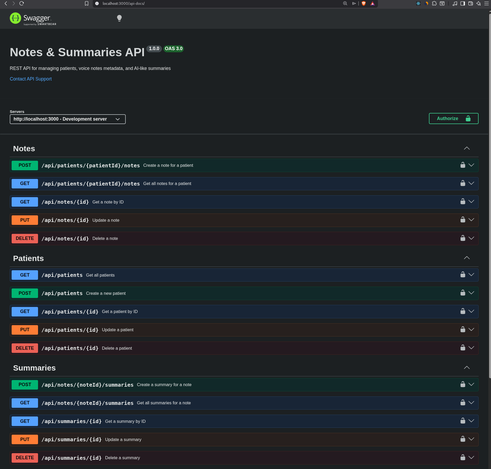

# Mini REST API Challenge : “Notes & Summaries”

## Goal
    A REST API for managing patients, voice note metadata, and AI-generated summaries. 
    Built with Node.js, TypeScript, Express, and SQLite.

## 📋 Table of Contents

    * Features
    * Tech Stack
    * Prerequisites
    * Installation
    * Configuration
    * Database Schema
    * API Documentation
    * Project Structure
    * Running the Application
    * Testing
    * API Endpoints
    * Error Handling
    * Development
## ✨ Features

    * Patient Management: Full CRUD operations for patient records
    * Voice Note Metadata: Manage voice note metadata (no actual file uploads)
    * AI Summaries: Create and manage plain-text summaries with version control
    * Input Validation: Request validation using Zod
    * Error Handling: Centralized error handling with detailed responses
    * API Documentation: Interactive Swagger/OpenAPI documentation
    * Rate Limiting: Built-in rate limiting (100 requests/minute)
    * Logging: Request logging for development
    * Type Safety: Full TypeScript implementation
    * Database: SQLite with better-sqlite3 for fast, reliable storage

## 🚀 Tech Stack
    Runtime: Node.js v18+
    Language: TypeScript
    Framework: Express.js
    Database: SQLite (better-sqlite3)
    Validation: Zod
    Documentation: Swagger UI + swagger-jsdoc
    Testing: Vitest + Supertest
    Code Quality: ESLint + Prettier

## 📦 Prerequisites

    Node.js >= 18.0.0
    npm or yarn

## 🚀 Installation

    1- Clone the repository
    
    git clone https://github.com/aben-cha/OctiCode-Challenge.git
    cd notes-summaries-api/

    2- Install dependencies
    
    npm install

    3- Create environment file

    cp .env.example .env

    4- Edit .env file

    PORT=3000
    NODE_ENV=development
    API_KEY=your-secret-api-key-here

## 🗄️ Database Schema
**Patients Table**

    CREATE TABLE patients (
        id INTEGER PRIMARY KEY AUTOINCREMENT,
        first_name TEXT NOT NULL,
        last_name TEXT NOT NULL,
        date_of_birth TEXT NOT NULL,
        medical_record_number TEXT UNIQUE NOT NULL,
        created_at TEXT NOT NULL DEFAULT (datetime('now')),
        updated_at TEXT NOT NULL DEFAULT (datetime('now'))
    );

**Notes Table**

    CREATE TABLE notes (
        id INTEGER PRIMARY KEY AUTOINCREMENT,
        patient_id INTEGER NOT NULL,
        doctor_id INTEGER NOT NULL,
        recorded_at TEXT NOT NULL,
        duration INTEGER NOT NULL,
        transcription TEXT,
        file_size INTEGER,
        file_format TEXT,
        created_at TEXT NOT NULL DEFAULT (datetime('now')),
        FOREIGN KEY (patient_id) REFERENCES patients(id) ON DELETE CASCADE
    );

**Summaries Table**

    CREATE TABLE summaries (
        id INTEGER PRIMARY KEY AUTOINCREMENT,
        note_id INTEGER NOT NULL,
        content TEXT NOT NULL,
        generated_at TEXT NOT NULL DEFAULT (datetime('now')),
        version INTEGER NOT NULL DEFAULT 1,
        FOREIGN KEY (note_id) REFERENCES notes(id) ON DELETE CASCADE
    );

## ## 📚 API Documentation
    Interactive API documentation is available via Swagger UI:
        
        http://localhost:3000/api-docs
    

    You can also access the OpenAPI spec in JSON format:
    
        http://localhost:3000/api-docs.json

## 🔌 API Endpoints

**Patients**:

    POST /api/patients - Create patient
    GET /api/patients - List all patients
    GET /api/patients/:id - Get specific patient
    PUT /api/patients/:id - Update patient
    DELETE /api/patients/:id - Delete patient

**Notes**:

    POST   /api/patients/:patientId/notes     - Create a note for a patient
    GET    /api/patients/:patientId/notes     - Get all notes for a patient
    GET    /api/notes/:id                     - Get a specific note by ID
    PUT    /api/notes/:id                     - Update a note
    DELETE /api/notes/:id                     - Delete a note

**Summaries**:

    POST   /api/notes/:noteId/summaries       - Create/generate a summary for a note
    GET    /api/notes/:noteId/summaries       - Get all summaries for a note
    GET    /api/summaries/:id                 - Get a specific summary by ID
    PUT    /api/summaries/:id                 - Update a summary
    DELETE /api/summaries/:id                 - Delete a summary

**Bonus**:

    GET /health - Health check endpoint

## 🏗️ Project Structure: 

    notes-summaries-api/
    ├── src/
    │   ├── server.ts                  # Application entry point (starts HTTP server)
    │   ├── app.ts                     # Express app configuration (middlewares & routes)
    │   ├── config/
    │   │   ├── config.ts              # Environment & app configuration
    │   │   └── swagger.ts             # Swagger/OpenAPI configuration
    │   ├── controllers/               # Request/response handlers
    │   │   ├── patients.ts            # Patients controller
    │   │   ├── notes.ts               # Notes controller
    │   │   └── summaries.ts           # Summaries controller
    │   ├── routes/                    # API route definitions
    │   │   ├── patients.ts            # /patients endpoints
    │   │   ├── notes.ts               # /notes endpoints
    │   │   └── summaries.ts           # /summaries endpoints
    │   ├── schemas/                   # Validation layer
    │   │   └── validation.ts          # Zod schemas for request validation
    │   ├── services/                  # Business logic & data access
    │   │   ├── database.ts            # SQLite initialization & connection
    │   │   ├── patients.ts            # Patients service
    │   │   ├── notes.ts               # Notes service
    │   │   └── summaries.ts           # Summaries service
    │   ├── middlewares/               # Cross-cutting concerns
    │   │   ├── auth.ts                # API key authentication
    │   │   ├── logger.ts              # Request logger
    │   │   ├── rateLimiter.ts         # Rate limiting per API key
    │   │   └── errorHandler.ts        # Centralized error handling
    │   ├── types/                     # TypeScript types
    │   │   └── entities.ts            # Entity interfaces / DTOs
    │   └── utils/                     # Shared utilities
    │       └── logger.ts              # Logger with request IDs
    ├── data/
    │   └── database.sqlite            # SQLite database file
    ├── tests/
    │   └── api.test.ts                # API integration tests
    ├── .env                           # Environment variables
    ├── package.json                   # Dependencies & scripts
    ├── tsconfig.json                  # TypeScript configuration
    ├── .prettierrc                    # Code formatting rules (bonus)
    └── .eslintrc.js                   # Linting rules (bonus)

## Architecture Flow (Simple Explanation)

    Client → Routes → Controllers → Services → SQLite
                    ↓
            Zod Validation
                    ↓
            Middlewares (auth, rate-limit, logger)

## 🏃 Running the Application
**Development Mode**

    npm run dev

**Production Build**

    npm run build
    npm start

**Available Scripts**

    Script                                   Description

    npm run dev                              Start development server with hot-reload
    npm run build                            Compile TypeScript to JavaScript
    npm start                                Run production build
    npm test                                 Run tests
    npm run test:run                         Run tests once (CI mode)
    npm run lint                             Check code with ESLint
    npm run lint:fix                         Fix ESLint errors
    npm run format                           Format code with Prettier
    npm run format:check                     Check code formatting
    npm run db:clean                         Remove database files

## 🧪 Testing

**Run the test suite:**
    
    npm test

**Run tests in CI mode:**

    npm run test:run

## 🔧 Development

**Code Style**

    This project uses ESLint and Prettier for code quality:

    # Check linting
    npm run lint

    # Fix linting issues
    npm run lint:fix

    # Format code
    npm run format

    # Check formatting
    npm run format:check

**Database Management**

    Reset the database:
        npm run db:clean
        npm run dev  # Will recreate the database

## 🔐 Authentication (Optional)

    API key authentication is available but disabled by default. To enable:
        1- Set API_KEY in .env
        2- Uncomment authentication middleware in src/app.ts:

            app.use('/api', authenticate);
        
        3- Include API key in requests:

            curl -H "x-api-key: your-secret-api-key" http://localhost:3000/api/patients

## 📊 Rate Limiting

    Default rate limits:

        100 requests per minute per API key
        Applies to all /api/* endpoints
        Returns 429 status when limit exceeded
    
    Customize in src/app.ts:

        app.use('/api', rateLimiter(200, 60000)); // 200 requests per minute

## 🐛 Troubleshooting

    Database is locked
        # Stop the server
            # Close any database viewers
            # Clean and restart
            npm run db:clean
            npm run dev
    
    Port already in use
        Change the port in .env:
            PORT=3001

    Module not found errors
        rm -rf node_modules package-lock.json
        npm install

## 📄 License
    This project is licensed under the MIT License.

##  Acknowledgments

    Express.js for the web framework
    better-sqlite3 for SQLite integration
    Zod for runtime validation
    Swagger UI for API documentation

## 📸 Screenshots

